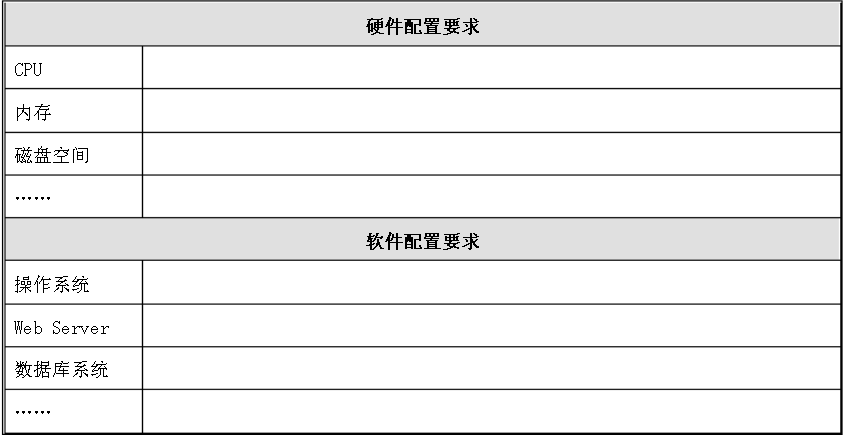
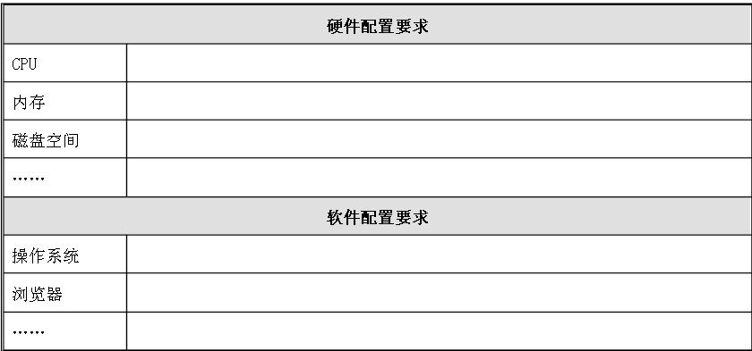
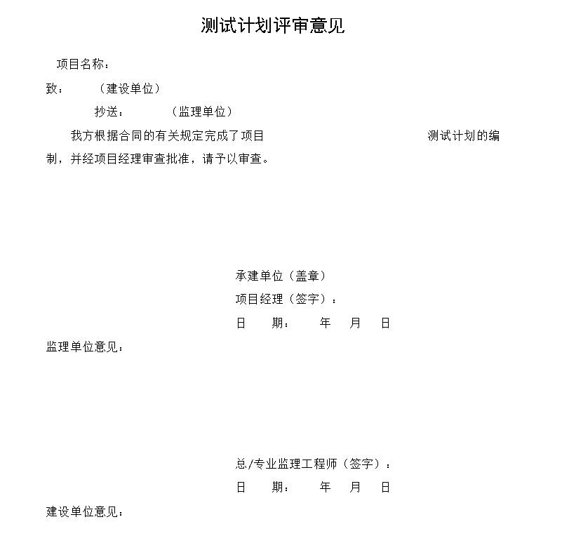

# 测试计划编写

- [测试计划编写](#测试计划编写)
  - [测试计划范例](#测试计划范例)
    - [引言](#引言)
      - [编写目的](#编写目的)
      - [项目背景](#项目背景)
      - [定义](#定义)
      - [参考资料](#参考资料)
    - [测试计划](#测试计划)
      - [测试准备](#测试准备)
        - [测试环境准备](#测试环境准备)
        - [测试人员准备](#测试人员准备)
          - [测试负责人](#测试负责人)
          - [测试人员](#测试人员)
        - [测试任务和进度](#测试任务和进度)
      - [测试策略和方法](#测试策略和方法)
        - [测试策略](#测试策略)
        - [测试方法](#测试方法)
        - [测试风险](#测试风险)
    - [测试种类及测试标准](#测试种类及测试标准)
      - [测试种类](#测试种类)
      - [测试标准](#测试标准)
        - [逻辑功能测试](#逻辑功能测试)
        - [界面测试](#界面测试)
        - [易用性测试](#易用性测试)
        - [兼容性测试](#兼容性测试)
        - [业务测试](#业务测试)
        - [压力测试](#压力测试)
    - [测试范围及测试重点](#测试范围及测试重点)
      - [测试范围](#测试范围)
      - [测试重点](#测试重点)

## 测试计划范例

### 引言

#### 编写目的
  
#### 项目背景

- 说明待开发的软件系统名称  
- 列出本项目的任务委托单位、开发单位、协作单位、用户单位  
- 说明项目背景，叙述开发意图、应用目标、作用范围等  
- 保密说明，本项可选，一般软件公司要求对软件开发概要设计文档进行保密，不允许复制、使用和扩散
到公司之外的范围  
- 版权说明

#### 定义

| 序号  | 术语名称 | 术语定义|
| ----  | ----   | ----  |
| 1    |      |     |
| 2    |      |     |
| 3    |      |     |

#### 参考资料  
  
- 本软件开发所核准的合同或标书或可行性报告等文档  
- 软件开发计划书
- 需求分析报告
- 测试方案
- 与本项目有关的一发表的文件或资料
- 本文件中各处引用的文件、资料、所采用的软件开发标准和规范（要标明出处）

| 序号 | 文档名称 | 作者 | 版本/日期 |
| ---- | ----   | ----  |---|
| 1   |     |    |       |
| 2   |     |    |       |  

### 测试计划

#### 测试准备

##### 测试环境准备

- 服务器

- 客户端
  

- 网络环境

##### 测试人员准备

提示：该项目主要测试负责人及测试人员

###### 测试负责人

- 为测试项目提供总体方向，制定测试计划、征集并监督测试人员、申请系统权限资源，控制和跟踪测试进度
  
###### 测试人员

- 对被测软件的详细了解、分解测试需求、编写测试用例
- 负责测试执行和记录结果
- 跟踪bug解决情况
- 汇报工作进程及测试结果
  
##### 测试任务和进度

| 测试阶段 |  任务 | 工作量估计 | 人员分配 | 时间 |
| ----   |  ---- | ----    | ----   | ---- |
| 测试环境搭建 | 搭建测试环境，包括：硬件环境，bug管理工具,项目安装 |       |     |    |
| 编写测试用例并评审通过 | 根据需求说明书，概要设计说明书，编写测试用例 |     |     |    |
| 功能测试 | 测试功能和业务流程是否达到设计要求             |     |     |    |
| 提交测试报告 | 根据项目进度计划，编写阶段性的测试报告         |     |     |    |
| 压力测试   | 测试系统在特定的硬件环境中的性能，稳定性等指标是否达到要求 |    |     |    |

#### 测试策略和方法

- 提示：说明本次所测试所采用何种方法和策略（如黑盒测试，其中采用边界值探测法、等价类划分法等测试方法）

##### 测试策略

- 提示：黑盒测试，根据编写的测试用例，通过手工创建数据的方法来验证各模块的功能是否正确。
  
##### 测试方法

  提示：此次测试主要进行功能测试就是对产品的各功能进行验证，根据功能测试用例，逐项测试，检查产品是否
达到用户要求的功能。针对web系统的常用测试采用如下方法：

- 页面链接检查：每一个链接是否都有对应的页面，并且页面之间切换正确。
- 相关性检查：删除/增加一项会不会对其他项产生影响，如果产生影响，这些影响是否都正确。
- 检查按钮的功能是否正确：如update、cancel、delete、save等功能是否正确
- 字符串长度检查：输入指定类型的内容的地方输入其他类型的内容，看系统是否报错
  
##### 测试风险

- 提示：对本次测试活动可能存在的风险预估计

> 如此次测试的部分没有经过需求的评审，且测试时间有限，开发人员是否及时发布版本直接影响进度
  
### 测试种类及测试标准

#### 测试种类

- 提示：如功能测试、业务测试等，依不同项目要求而定  
  
> 本次测试活动涉及到界面测试、逻辑功能测试、易用性测试、兼容性测试、业务测试和压力测试。

#### 测试标准

- 提示：列出进过各种测试后，软件应达到的标准（如功能测试：能够按照设计要求实现该模块的各个功能，进出
模块数据流向正确，各项数据完整/准确）

##### 逻辑功能测试

- 概述

> 能够按照需《求规格说明书》和《概要设计说明书》要求实现各模块的各个功能，业务流程要求，进出模块数据流向正确，
各项数据完整\准确。

- 标准
  利用有效的和无效的数据来执行各个用例流，以核实以下内容
  
> 在使用有效数据时得到预期的结果；
> 在使用无效数据时显示相应的错误消息或警告消息；
> 使用有效数据时工作流通畅并得到期望结果；
> 参考规范：《常用测试用例表_V1.0》常用功能部分

##### 界面测试

- 概述

严格按照需求说明书总的界面设计图和公司的UI标准执行界面测试，验证界面是否美观、布局是否正确合理。

- 标准

  核实以下内容：  
  > 确保各种访问方法（确保葛总访问方法（鼠标移动、快捷键））都使用正常
  > 确保窗口对象及其特征（菜单、大小、位置、状态和中心）都符合标准等；
  > 参考规范：《系统界面样式规范》、《常用测试用例表_V1.0》界面部分

##### 易用性测试

- 概述
  从软件使用的合理性和方便性等角度对软件系统进行检查，来发现软件中不方便用户使用的地方。

- 标准
  核实如下内容
  > 窗口上按钮的布局要与界面相协调，不要过于密集，要不要过于空旷；
  > 界面上的字体一般为宋体，自豪一般为8-12号；
  > 测试窗体在常用分辨率下的显示情况
  
##### 兼容性测试

- 概述
  核实测试对象再不同软件和硬件配置中的运行情况

- 标准
  确定系统能再下列条件下正常运行：
  > 在各种所需的硬件和软件配置中；
  > 在各种浏览器下的兼容测试；

| 检查项 | 测试人员的类别及其评价 |
| ----  | ----          |
| 系统支持多操作平台吗？支持多种浏览器吗？ | IE6.0、IE7.0 |

##### 业务测试

- 概述
  能够满足系统原型的业务流程要求，相应操作时业务规则的流向恰当，并发情况流程下流程正常。

- 目标
  按照系统原型的业务流程验证有效和无效数据的用例流，核实以下内容：

> 使用无效数据时工作流程通畅并得到期望结果；
> 使用无效数据时，显示相应的错误信息或警告信息。

##### 压力测试

- 概述
  这里具体包含了负载测试以及压力测试

- 目标
  核实下列行为下的系统行为
  > 确定测试对象在给定时间内能够持续处理的最大负载或工作量（包括长时间处理多个用户相同的且性能最坏的业务）；
  > 确定并确保系统在超出最大预期工作量的情况下仍能正常运行，并评估其性能特征，包括响应时间、事务处理速率和其他
与时间相关的内容。

### 测试范围及测试重点

#### 测试范围

- 提示：与测试需求内容完全对应，在此只需注明本次测试活动中涉及的模块名称及子模块名称。
  
#### 测试重点

  针对不同项目要求的侧重点不同而设计。

- 数据管理
  > 测试数据的新增、编辑、删除功能的正确性。

- 数据统计
  > 测试成果统计功能中统计数据的正确性。

- 权限设置
  > 测试操作权限的有效性。

